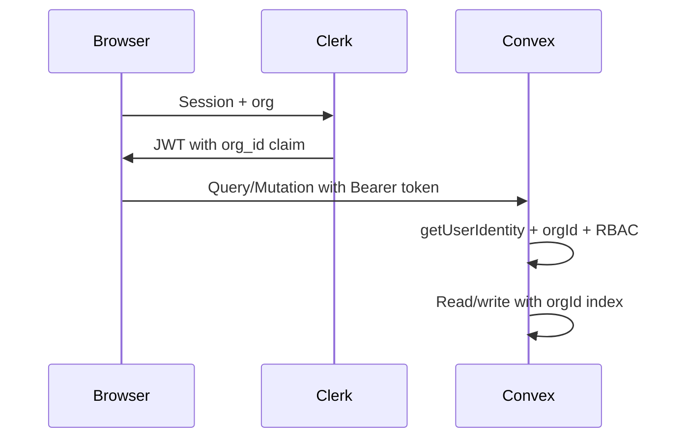

# Accounting MVP: Convex + Clerk B2B Plan

## Current baseline

- App root: **[countify/](countify/)** (not `Countify` repo root). Next.js **16** (your spec said 14; staying on 16 is fine).
- Already wired: [`ClerkProvider`](countify/app/layout.tsx) → [`ConvexProviderWithClerk`](countify/components/ConvexClientProvider.tsx), [`convex/auth.config.ts`](countify/convex/auth.config.ts) with `applicationID: "convex"`, placeholder [`convex/schema.ts`](countify/convex/schema.ts), [`proxy.ts`](countify/proxy.ts) using `clerkMiddleware` (Next 16 may use `proxy.ts` instead of `middleware.ts`—keep one pattern per Next docs).
- **Convex agent rules**: Before implementing Convex code, read [`convex/_generated/ai/guidelines.md`](countify/convex/_generated/ai/guidelines.md) (and [`AGENTS.md`](countify/AGENTS.md)); use the **`convex-setup-auth`** skill flow from [`skills-lock.json`](countify/skills-lock.json) when touching auth.
- **`convexAuthNextjsMiddleware`**: That API is from **Convex Auth** (`@convex-dev/auth`), not Clerk. For **Clerk + Convex**, use **`clerkMiddleware()`** (already present) plus Clerk’s **Convex JWT template** so Convex receives a valid token. Do not mix two auth systems unless you explicitly migrate.
- **shadcn/ui**: Already installed with **your colors, theme, and scheming**. Implementation must **respect that template**: do not re-run `shadcn init`, do not replace `components.json`, CSS variables, or global theme tokens unless you explicitly ask. New components should be added with the CLI **onto the existing config** so variants map to the same design tokens; use existing primitives under `components/ui` and semantic Tailwind classes (`bg-background`, `text-foreground`, `border-border`, `primary`, `muted`, etc.) so screens stay visually consistent.

---

## Phase 0 — Dependencies and UI shell

- **Do not** re-initialize or overwrite the existing shadcn setup; **only add** any still-missing app dependencies (e.g. **Recharts**, **React Hook Form**, **Zod**, **date-fns**, **sonner** if not already added). **@convex-dev/eslint-plugin** is already present—extend ESLint as needed.
- Ensure **mobile-first** layouts: collapsible sidebar, responsive tables (horizontal scroll + card fallback on small screens), touch-friendly actions—all styled with the **existing** shadcn theme.

---

## Phase 1 — Clerk B2B + Convex auth (foundation)

### Clerk Dashboard (Organizations)

- Enable **Organizations**; use **Organization invitations** for members.
- **JWT template** for Convex (named per Convex docs, audience `convex`): add **custom claims** for active org, e.g. `org_id` (org id string) and `org_role` (or map Clerk org role → `owner|admin|accountant|viewer`). Per [Convex auth docs](https://docs.convex.dev/auth/functions-auth.md), **custom claims are returned on `getUserIdentity()`**—so **`orgId` is never taken from client args**; read it from `identity` in every function.
- Optional: `convexAuthNextjsMiddleware` is **not** required for this stack; keep **`clerkMiddleware`** and extend route matchers for `(dashboard)` and org selection.

### Clerk + Next.js routes

- **`(auth)`**: `sign-in`, `sign-up`, **`/org-selection`** or use Clerk’s org flow so users land with an active org before the app shell.
- **`(dashboard)`**: All protected routes behind auth + **active organization** (use `<OrganizationSwitcher />` in header; block dashboard if no org).

### Convex: auth helpers and user sync

- Add **`convex/lib/auth.ts`** (or similar) with:
  - `requireIdentity(ctx)` → throws if `getUserIdentity()` is null.
  - `requireOrgId(identity)` → `org_id` from identity; throws if missing (forces org context).
  - `getRole(identity)` / `requireRole(ctx, minRole)` using synced `users.role` or JWT `org_role` (prefer **DB role** after sync for consistency with RBAC).
- **`users.sync`** (mutation): idempotent upsert on first login—`clerkId` = `identity.tokenIdentifier`, `orgId` from identity, name/email from identity; **never** accept `orgId` from args.
- **Indexes**: Every tenant table: `index("by_org", ["orgId"])` and composite indexes as needed (e.g. `by_org_and_number` for invoices).

### Schema (tables)

Implement your spec in **[countify/convex/schema.ts](countify/convex/schema.ts)** with:

- **`users`**: `clerkId`, `orgId`, `name`, `email`, `role`, plus `createdAt`, `updatedAt`, `createdBy` (store `users` id or `clerkId` string consistently).
- **Domain tables**: `contacts`, `invoices`, `payments`, `expenses`, `accounts`, `journalEntries`, `bankTransactions`, `auditLogs` as specified—**all `orgId` + indexes**.
- **Optional but recommended**: **`organizations`** (or **`orgSettings`**) keyed by Clerk `orgId` for company profile, fiscal year, defaults, and **billing tier mirror** (see Phase 1b). Keeps org-level data out of `users`.

**Convex guideline note**: `guidelines.md` warns against **unbounded arrays** on documents. Your spec embeds **invoice line items** and **journal lines**. For MVP you can embed with a **reasonable max** (validation + Zod) and plan a later migration to **`invoiceLines`** / **`journalLines`** tables if documents grow large.

**Money/dates**: Integers (cents) + `number` for ms timestamps; document in validators.

### Audit logging

- **`auditLogs`**: Small helper used by mutations to append `entityType`, `entityId`, `action`, `userId`, `timestamp`.

---

## Phase 1b — Clerk Billing (tiers + future gates)

- In Clerk Dashboard: define **Plans** (e.g. Free, Pro) and **Features** (placeholders until you decide limits).
- **Frontend**: Pricing / subscription UI via Clerk Billing components or hooks (`usePlans`, checkout flows)—see [Clerk Billing docs](https://clerk.com/docs/nextjs/billing/b2c-saas) (B2B/org billing: confirm org-level vs user-level in Clerk for your product).
- **Server truth for Convex**: Implement a **Convex HTTP route** ([`convex/http.ts`](countify/convex/http.ts)) + **`internal` mutation** to process **Clerk webhooks** (subscription created/updated/canceled) and update **`organizations.billingTier`** / feature flags. Mutations that need gating call **`assertFeature(ctx, "feature_key")`** reading from DB (not from client).
- **Until gates are defined**: Ship the **schema fields + webhook stub** and a single **“Pro”** feature flag used in one non-critical path (e.g. export) to prove the pattern.

---

## Phase 2 — Layout, sidebar, org switcher

- **`app/(dashboard)/layout.tsx`**: Sidebar and shell using **existing** shadcn components and tokens; nav links to dashboard, invoices, expenses, contacts, accounts, bank, reports, settings; **OrganizationSwitcher** + **UserButton**; `useOrganization()` for display.
- Hooks: **`useCurrentOrg`** (Clerk `useOrganization`), **`useCurrentUser`** (Clerk `useUser` + Convex `useQuery(api.users.me)` for role).

---

## Phases 3–9 — Feature modules (your build order)

For each module: **queries/mutations** in `convex/*.ts` (split by file as in your spec), **UI** under `app/(dashboard)/...` and `components/...`.

| Step | Focus | Key implementation notes |
|------|--------|---------------------------|
| **3** | Contacts | CRUD + `by_org` index + `type` customer/vendor; optional balance **derived** from invoices/payments (or denormalized counter updated on writes). |
| **4** | Invoicing | Numbering: unique per org (mutation with index or counter doc); statuses; totals in cents; payments child table; confirm modals + toasts. |
| **5** | Expenses | CRUD + `generateUploadUrl` / `storage.getUrl` for receipts; link optional `contactId`. |
| **6** | COA + journals | Hierarchical `accounts`; journal mutation validates **debits = credits**; lines reference `accountId`. |
| **7** | Reports | P&L, balance sheet, aged AR/AP—**bounded queries**; aggregate in batches or precompute if needed (per guidelines, avoid unbounded `collect`). |
| **8** | Bank CSV | Parse CSV in **action** or client → mutation insert `bankTransactions`; match UI updates `matchedTo` / `reconciled`. |
| **9** | Settings | Company profile, logo (Convex file storage), currency, fiscal year, invoice branding—stored on `orgSettings`. |

**RBAC**: Enforce in **every mutation** (and sensitive queries): `viewer` read-only; `accountant`/`admin`/`owner` as per your matrix. Mirror Clerk org roles to Convex `users.role` on sync/webhook if needed.

---

## Cross-cutting standards (from your spec)

- **UI**: Compose from existing shadcn primitives and your theme; avoid one-off hex colors or hard-coded palettes that bypass CSS variables.
- Forms: **RHF + Zod**; lists: **pagination** (`paginationOptsValidator`); empty states; destructive actions → **Confirm**; mutations → **toast** success/error.
- **`lib/formatCurrency`**, **`lib/constants`** for enums.
- No `any`; use `Id<"table">` and `Doc<"table">` from [`generated dataModel`](countify/convex/_generated/dataModel.d.ts).

---

## Architecture (data flow)

---

## Deliverables checklist

- [ ] Full schema + indexes in `convex/schema.ts`
- [ ] Auth helpers + `users.sync` + `me` query
- [ ] Clerk org + JWT custom claims documented in `.env.example` (no secrets)
- [ ] Dashboard routes + shell + org switcher
- [ ] Modules 3–9 incrementally
- [ ] Clerk Billing + webhook + `billingTier` / feature flags for future gates
- [ ] Responsive UI with shadcn, consistent with your existing theme and `components.json`
